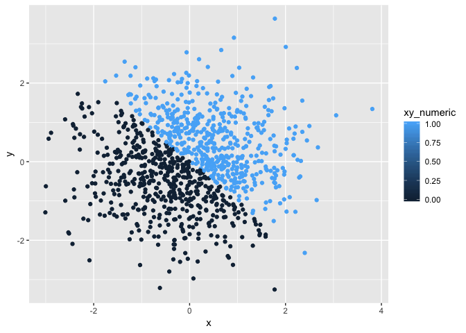
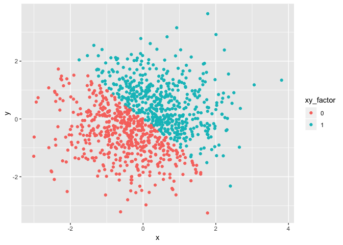

Homework One
================
Yi Xiao
2018-09-11

This assignment reinforces ideas in the building blocks topic.

#### Load packages first:

``` r
library(tidyverse)
```

    ## ── Attaching packages ────────────────────────────────────────────────────── tidyverse 1.2.1 ──

    ## ✔ ggplot2 3.0.0     ✔ purrr   0.2.5
    ## ✔ tibble  1.4.2     ✔ dplyr   0.7.6
    ## ✔ tidyr   0.8.1     ✔ stringr 1.3.1
    ## ✔ readr   1.1.1     ✔ forcats 0.3.0

    ## ── Conflicts ───────────────────────────────────────────────────────── tidyverse_conflicts() ──
    ## ✖ dplyr::filter() masks stats::filter()
    ## ✖ dplyr::lag()    masks stats::lag()

``` r
library(ggplot2)
```

*Problem 1*
===========

This problem focuses on variable types and coercion

#### 1. Here's a **code chunk** that create a data frame with:

-   A random sample of size 10 from a uniform\[0, 5\] distribution

-   A logical vector indicating whether elements of the sample are greater than 2

-   A (length-10) character vector

-   A (length-10) factor vector

``` r
set.seed(1)
pr1_df = tibble(
    vec_numeric = runif(10, min = 0, max = 5),
    vec_logical = vec_numeric > 2,
    vec_character = c("ab","zb","c7y","zd","ab","f","g","h","i","k"),
    vec_factor = factor(c("F","F","M","F","M","M","M","F","M","F"))
)
```

#### 2. Here is a \*\* code chunk \*\* that takes the mean of each variable in the dataframe:

``` r
  mean(pr1_df$vec_numeric)
```

    ## [1] 2.757569

``` r
  mean(pr1_df$vec_logical)
```

    ## [1] 0.6

``` r
  mean(pr1_df$vec_character)
```

    ## Warning in mean.default(pr1_df$vec_character): argument is not numeric or
    ## logical: returning NA

    ## [1] NA

``` r
  mean(pr1_df$vec_factor)
```

    ## Warning in mean.default(pr1_df$vec_factor): argument is not numeric or
    ## logical: returning NA

    ## [1] NA

When the mean function was applied to the numeric and logical variable, the mean of those two varaibles were returned successfully. However, NA was returned when the function was applied to character and factor variables. This is because the argument of mean function can only be numerical and logical, where it will convert TRUE to 1 and FALSE to 0.

#### 3. Here's a **code chunk** that convert logical, character, and factor to numeric:

``` r
as.numeric(pr1_df$vec_logical)
as.numeric(pr1_df$vec_character)
as.numeric(pr1_df$vec_factor)
```

During the logical-to-numerical convert, TRUE was coverted to 1 and False to 0, while NA was generated by character-to-numerical coercion. Factors were converted into numericals according to the levels.

#### Here is a **code chunk** that convert character to factor to numeric:

``` r

as.numeric(as.factor(pr1_df$vec_character))
##  [1] 1 8 2 9 1 3 4 5 6 7
```

First character was converted to factor: each element with different name becomes a new level of factor. Then factor was further converted into numeric: integers were assigned according to alphabetic order.

#### Here's a **code chunk** that convert factor to character to numeric:

``` r
 
as.numeric(as.character(pr1_df$vec_factor))
## Warning: NAs introduced by coercion
##  [1] NA NA NA NA NA NA NA NA NA NA
```

NA was introduced during character-to-numeric coercion.

*Problem 2*
===========

This problem focuses on plotting and the use of inline R code.

#### Here's a **code chunk** that create a data frame with:

-   x: a random sample of size 1000 from a standard Normal distribution

-   y: a random sample of size 1000 from a standard Normal distribution

-   A logical vector indicating whether the x + y &gt; 0

-   A numeric vector created by coercing the above logical vector

-   A factor vector created by coercing the above logical vector

``` r
set.seed(1)
pr2_df = tibble(
        x = rnorm(1000),
        y = rnorm(1000),
        xy_logical = x + y > 0,
        xy_numeric = as.numeric(xy_logical),
        xy_factor = factor(xy_numeric)
)
```

-   The size of the dataset: **1000** rows and **5** colunmns.

-   The mean and median of x: **-0.0116481** and **-0.0353242**

-   The proportion of cases for which the logical vector is TRUE:
    **0.49**

#### Here's a **code chunk** that create a scatterplot:

-   *color points using the logical variable*

``` r
library(ggplot2)
ggplot(pr2_df, aes(x = x, y = y)) + geom_point(aes(colour = xy_logical))
```


``` r
ggsave("myplot1.png")
```

    ## Saving 7 x 5 in image

-   *color points using the numeric variable*

``` r
library(ggplot2)
ggplot(pr2_df, aes(x = x, y = y)) + geom_point(aes(colour = xy_numeric))
```



``` r
ggsave("myplot2.png")
```

    ## Saving 7 x 5 in image

-   *color points using the factor variable*

``` r
library(ggplot2)
ggplot(pr2_df, aes(x = x, y = y)) + geom_point(aes(colour = xy_factor))
```



``` r
ggsave("myplot3.png")
```

    ## Saving 7 x 5 in image
