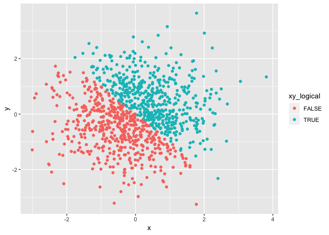

Homework One
================
Yi Xiao
2018-09-11

This assignment reinforces ideas in the building blocks topic.

*Problem 1*
===========

This problem focuses on variable types and coercion

#### Here's a **code chunk** that create a data frame with:

-   A random sample of size 10 from a uniform\[0, 5\] distribution

-   A logical vector indicating whether elements of the sample are greater than 2

-   A (length-10) character vector

-   A (length-10) factor vector

``` r
set.seed(1)
samp_uni <- runif(10, min = 0, max = 5)
samp_compare <- samp_uni > 2
samp_name <- c("ab","zb","c7y","zd","ab","f","g","h","i","k")
samp_factor <- factor(c(1,2,3,1,2,3,2,1,3,2))
all_data <- data.frame(samp_uni, samp_compare, samp_name, samp_factor)
all_data
```

    ##     samp_uni samp_compare samp_name samp_factor
    ## 1  1.3275433        FALSE        ab           1
    ## 2  1.8606195        FALSE        zb           2
    ## 3  2.8642668         TRUE       c7y           3
    ## 4  4.5410389         TRUE        zd           1
    ## 5  1.0084097        FALSE        ab           2
    ## 6  4.4919484         TRUE         f           3
    ## 7  4.7233763         TRUE         g           2
    ## 8  3.3039890         TRUE         h           1
    ## 9  3.1455702         TRUE         i           3
    ## 10 0.3089314        FALSE         k           2

The **mean** of samp\_uni and samp\_compare is **2.7575694** and **0.6** respectively, however the mean of other two variables are **NA** and **NA** because the argument of the mean function can only be numeric or logical.

#### Here's a **code chunk** that convert logical, character, and factor to numeric:

``` r
as.numeric(samp_compare)
as.numeric(samp_name)
as.numeric(samp_factor)
```

When convert logical to numeric, TRUE was coverted to 1 and False to 0. While NA was generated by character-to-numerical coercion. The same factors were converted to the same numericals.

#### Here is a **code chunk** that convert character to factor to numeric:

``` r
# 1. character to factor
as.factor(samp_name)
##  [1] ab  zb  c7y zd  ab  f   g   h   i   k  
## Levels: ab c7y f g h i k zb zd

# 2.character to numeric
as.numeric(samp_name)
##  [1] NA NA NA NA NA NA NA NA NA NA

# character to factor then to numeric
as.numeric(as.factor(samp_name))
##  [1] 1 8 2 9 1 3 4 5 6 7
```

When converting character to factor: each element with different name becomes a new level of factor; when converting character to numeric: NA was generated; when converting character to factor then to numeric: numeric was assigned according to alphabetic order.

#### Here's a **code chunk** that convert factor to character to numeric:

``` r
# 1. factor to character
as.character(samp_factor)
##  [1] "1" "2" "3" "1" "2" "3" "2" "1" "3" "2"
# 2. factor to numerical
as.numeric(samp_factor)
##  [1] 1 2 3 1 2 3 2 1 3 2
# 3. factor to character then to numerical 
as.numeric(as.character(samp_factor))
##  [1] 1 2 3 1 2 3 2 1 3 2
```

*Problem 2*
===========

This problem focuses on plotting and the use of inline R code.

#### Here's a **code chunk** that create a data frame with:

-   x: a random sample of size 1000 from a standard Normal distribution

-   y: a random sample of size 1000 from a standard Normal distribution

-   A logical vector indicating whether the x + y &gt; 0

-   A numeric vector created by coercing the above logical vector

-   A factor vector created by coercing the above logical vector

``` r
set.seed(2)
x <- rnorm(1000)
set.seed(3)
y <-rnorm(1000)
sum_greater_zero <- x + y > 0
numer_greater_zero <- as.numeric(sum_greater_zero)
sum_group <- as.factor(numer_greater_zero)
all_data2 <- data.frame(x, y, sum_greater_zero, numer_greater_zero, sum_group)
```

-   The size of the dataset: **1000**

-   The mean and median of x: **0.0619987** and **0.0501354**

-   The proportion of cases for which the logical vector is TRUE:
    **0.504**

#### Here's a **code chunk** that create a scatterplot:

-   *color points using the logical variable*

``` r
library(ggplot2)
ggplot(all_data2, aes(x = x, y = y)) + geom_point(aes(colour = sum_greater_zero))
```


``` r
ggsave("myplot1.png")
```

    ## Saving 7 x 5 in image

-   *color points using the numeric variable*

``` r
library(ggplot2)
ggplot(all_data2, aes(x = x, y = y)) + geom_point(aes(colour = numer_greater_zero))
```


``` r
ggsave("myplot2.png")
```

    ## Saving 7 x 5 in image

-   *color points using the factor variable*

``` r
library(ggplot2)
ggplot(all_data2, aes(x = x, y = y)) + geom_point(aes(colour = sum_group))
```



``` r
ggsave("myplot3.png")
```

    ## Saving 7 x 5 in image
